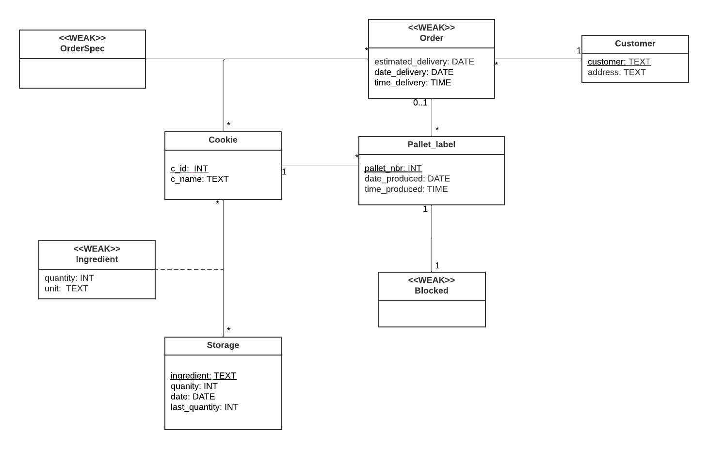

# EDAF75, project report

This is the report for

- Julia Bäcklund, `ju5360ba-s`
- Erik Dahlberg, `er8251da-s`

We solved this project on our own, except for:

- The Peer-review meeting

## ER-design

The model is in the file [`er-model.png`](er-model.png):

<center>
    
</center>

The image above describes the model for our Krusty Kookies application.

## Tables

The ER-model above gives the following tables (including keys and
foreign keys):

```text
table cookies:
  c_name
  PK: c_name

table orders:
  order_id
  estimated_delivery
  date_delivery
  time_delivery
  customer_id
  PK: order_id
  FK: customer_id -> customers(customer_id)

table customers:
  customer_id
  customer_name
  customer_address
  PK: customer_id

table pallets:
  pallet_nbr
  date_produced
  order_id
  c_name
  blocked
  PK: pallet_nbr
  FK: order_id -> orders(order_id)
  FK: c_name -> cookies(c_name)

table order_specs:
  c_name
  order_id
  PK: c_name, order_id
  FK: c_name -> cookies(c_name)
  FK: order_id -> orders(order_id)

table ingredients:
  quantity
  c_name
  ingredient
  PK: c_name, ingredient
  FK: c_name -> cookies(c_name)
  FK: ingredient -> storages(ingredient)

table storages:
  ingredient
  unit
  store_quantity
  store_date
  store_last_quantity
  PK: ingredient

```

## Scripts to set up database

The scripts used to set up and populate the database are in:

- [`create-schema.sql`](create-schema.sql) (defines the tables), and
- [`initial-data.sql`](initial-data.sql) (inserts data).

So, to create and initialize the database, we run:

```shell
sqlite3 krusty-db.sqlite < create-schema.sql
sqlite3 krusty-db.sqlite < initial-data.sql
```

## How to compile and run the program

This section should give a few simple commands to type to
compile and run the program from the command line, such as:

To run the test-program, use the following commands:

```shell
sqlite3 krusty-db.sqlite < create-schema.sql
```

```shell
python krusty.py
```

```shell
python test.py
```

To run it using our initial-data, use the following commands:

```shell
sqlite3 krusty-db.sqlite < create-schema.sql
```

```shell
sqlite3 krusty-db.sqlite < initial-data.sql
```

```shell
python krusty.py
```

## Observe

Ingredients in our solution refers to recipes in the project description and storages refers to ingredients.
